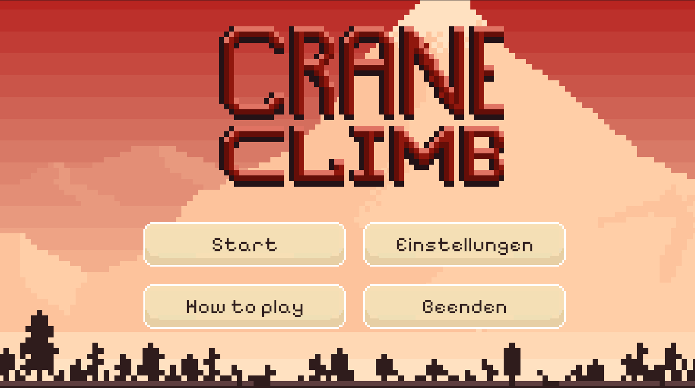
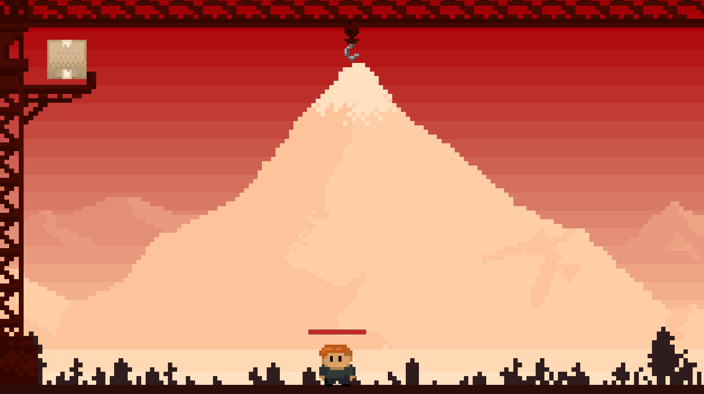
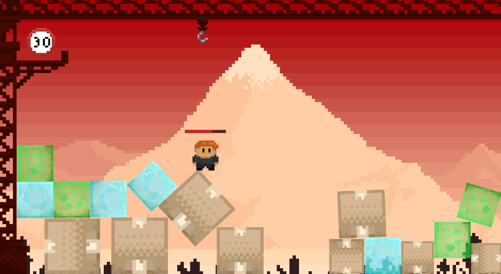

# CraneClimb

This game was created for the DETTA Game Jam 09. The theme of the jam was "Aufsteigen" with the sub-theme "Rauszoomen".
It is a one-versus-one game in which player one (Crane) tries to squash player two (Climber) with various boxes. The climber's goal is to climb the crane.

## Controls

It's possible to connect two controllers to play the game or use one keyboard.

### Crane:
- <b>A/D</b> move left/right
- <b>W</b> pick up boxes
- <b>S</b> drop boxes

### Climber:
- <b>Left/Right arrow key</b> move left/right
- <b>Up arrow key</b> jump
- <b>Down arrow key</b> pull boxes

## Download

https://blendomatik.itch.io/crane-climb

## Screenshots

